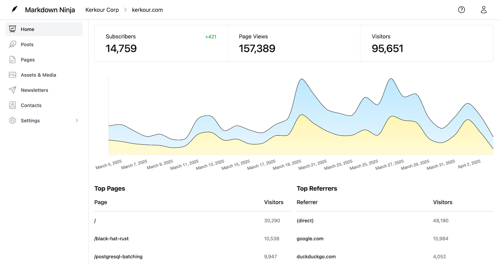

<p align="center">
  <a href="https://markdown.ninja" target="_blank" rel="noopener"></a>
  <h1 align="center">Markdown Ninja</h1>
  <h3 align="center">Markdown-first CMS for bloggers, minimalists and startups. Websites, blogs and newsletters.</h3>
  <h3 align="center">
    <a href="https://markdown.ninja">Try it for free!</a> | <a href="https://kerkour.com">Example website</a>
  </h3>
</p>

Markdown Ninja is the easiest way to publish Markdown-based websites and newsletters. The days of hacking a static site generator, a broken theme, a complex CI/CD pipeline and a cloud platform with unlimited billing to publish a website are long gone!



You can now publish your blog, documentation website or newsletter with one command:

```bash
$ docker run -i --rm -e MARKDOWN_NINJA_API_KEY=[YOUR_API_KEY] -v `pwd`:/mdninja ghcr.io/bloom42/markdown-ninja publish
```

[Get started in 2 minutes](https://docs.markdown.ninja/cli)


## Documentation

For usage documentation see [https://docs.markdown.ninja](https://docs.markdown.ninja)

For development documentation see the [dev folder](dev)


## Security

We take Markdown Ninja's security and our users' trust very seriously. If you believe you have found a security issue in Markdown Ninja, please responsibly disclose by contacting us: [https://markdown.ninja/contact](https://markdown.ninja/contact)


## License & Copyright

Copyright (c) 2025 Arcane Services

Code is released under the GNU Affero General Public License v3.0 (AGPL v3.0) license. See `LICENSE.txt` for details.

Documentation and assets are released under the Creative Commons BY-SA 4.0 license (CC BY-SA 4.0) license. See `LICENSE_CC-BY-SA-4.txt` and [https://creativecommons.org/licenses/by-sa/4.0](https://creativecommons.org/licenses/by-sa/4.0) for details.

If you have special licensing needs, please feel free to contact us: [https://markdown.ninja/contact](https://markdown.ninja/contact)
